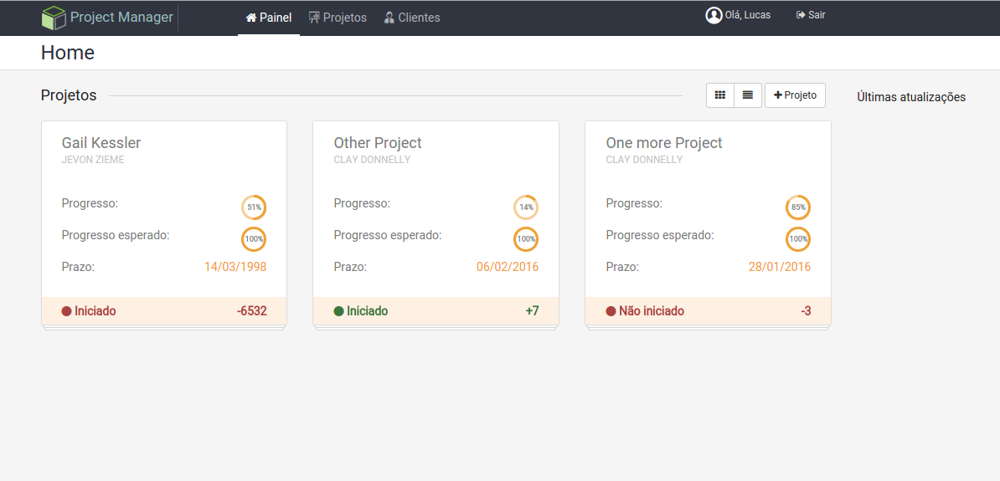

## Project Manager System
Project manager system built with Laravel and AngularJS

## Installation

- Clone repository
```
$ git clone https://github.com/deoliveiralucas/project-manager-laravel.git
```

- Copy `.env.example` to `.env` and add your configs
```
$ cp .env.example .env
```

- Access directory
```
$ cd project-manager-laravel
```

- Install PHP dependencies ([composer](http://getcomposer.org))
```
$ composer install
```

- Install Javascript dependencies ([nodejs](https://nodejs.org/en/))
```
$ npm install
```

- Download frond-end libraries ([bower](http://bower.io/))
```
$ bower install
```

- Execute tasks (test enviroment) ([gulp](http://gulpjs.com/))
```
$ gulp watch-dev
```

## Server start

- Open new terminal
```
$ php artisan serve
```

- *user: contato@deoliveiralucas.net*
- *password: 123456*


## Homepage


